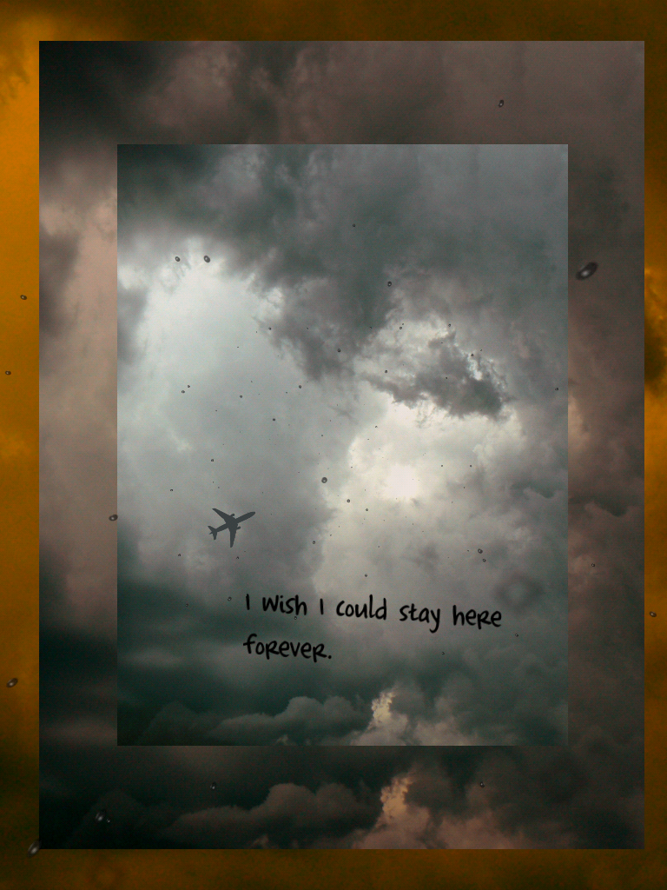

# Making Exercise Eleven: Narrative

As we continue our play with P5.js, conceptualize a project that uses P5.js for a more significant playful, narrative, or interactive purpose. You might draw on influences discussed in this week's demo, such as [Algorithmic Sea](https://the-color-of-water.github.io/AlgorithmicSea-ObservableArti) and [Strange Rain](https://erikloyer.com/index.php/projects/detail/strange_rain), shown below, or you can build on a concept you started last week or earlier in the semester.

Think of this as a free-form exercise to take your work with agentic tools to a next level: try sharing a prototype design notes, data, and anything else that is relevant to your goals in the GitHub repository before you start. Make sure to use "Planning" mode to think through the idea and clarify the design before the agent starts implementation.

## The Narrative Prompt

As we'll be taking our inspiration from electronic poetry and narratives as a form of making this week, this is a free-form exercise in building your P5.js knowledge while exploring computational creativity. Work between existing code and agentic tools: I recommend building a prototype or outline first, moving it into GitHub, and then expanding it with agentic tools, as I demonstrate in this week's video. I've provided three starters that suggest different possibilities for working with P5.js to allow for moving or interactive text, but feel free to try something different as a starting point. After watching the video, explore their capabilities, and then think about making your own. There are suggestions in each for ways to push the style, text, and design further. Focus on:

- **Experiment with code and debugging.** Try things, and break it. Modify small aspects of the code directly in GitHub, as shown in the demo. Consider loading in images (add them to your GitHub repository), exploring interactivity, and think about how you can work from basic shapes and text to leave an impression. Remember, if you break things you can always go back and fork the original code.
  
- **Change aesthetics and poetics.** Play with the text, and think about how you can use text and color to convey emotion. Try building a mood, and consider branching out to draw in images or create a sense of space. 

- **Generate your own elements.** Using [Claude Code Web](https://claude.ai/code) and building on our efforts last week, extend your project in a direction you find compelling. Think about the examples provided, and try to use precise prompting and edit the resulting code/text as needed to achieve your goals.

As always, include links and screenshots of your forked experiments and the new prototype on GitHub.

## Walkthrough and Resources

For an extended example of this way of working, check out my recent piece in _Kairos,_ ["AI Admin: Provocations through Generated Play."](https://kairos.technorhetoric.net/30.2/disputatio/salter/) The first version was built in 2024, before agentic tools were particularly capable, and thus includes a lot of hand-written code and my on work. The second version was built using the methods shown in this week's demo, which used that as a prototype to iterate and expand upon. 

If you want a simple starter to manipulate, consider using one of the ones from the demo:

- [Click Poetry](https://openprocessing.org/sketch/1325975) builds on our last mouse interaction piece: click to place a line of text. The work will cycle through a text in order, allowing for a sense of narrative progression or poetry if you write your lines intentionally. The text gradually fades from the screen.
- [Falling Text](https://openprocessing.org/sketch/1325914) uses a simple particle system to create moving text, inspired by *Strange Rain.* Don't worry about changing the code for the particle system itself: you can manipulate the speeds, positions, colors, and text to transform the experience.
- [Moving Click Text](https://openprocessing.org/sketch/1325979) combines elements of the other two examples to create moving text where the user clicks. The lines will become unreadable as they shift across the screen and fade. Again, don't worry about changing the code for the particle system itself.

If you want to explore further, try following the exercises in the [Creative Coding](https://creative-coding.decontextualize.com/) resources.
