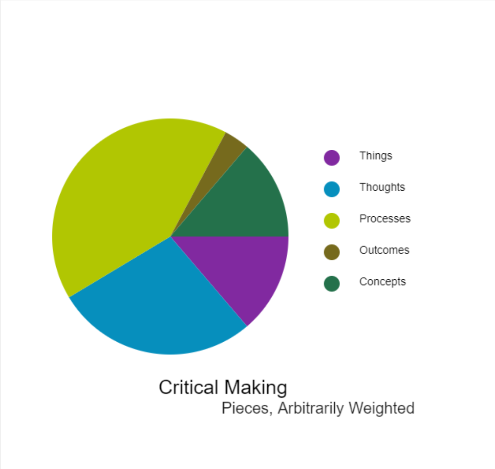

# Making Exercise Ten: Code

This week, we'll be taking our first steps with [P5.js](https://p5js.org/), a library that allows for visualization, animation, and interaction on the web. The goal this week is to explore P5 directly, with AI for assistance in code and interpretation as you choose, in preparation for building a more complex agentic-driven project next week.

## The Code Prompt

Before the advent of AI as a meta-tool for low code development, critical making and digital humanities generally involved building code literacy. What is code literacy now, and how does becoming familiar with this way of organizing and thinking about making serve in the current context? We'll be exploring this at multiple levels during the next few weeks. For this exercise, try:

- **Build a simple sketch from "scratch."** Follow the guidance in my demo, and try playing with static or interactive shapes, text, and colors. Don't worry about doing anything fancy - just try to get more confident authoring the code.
- 
- **Change and play with the provided P5 structures.** Take screenshots or share links to your forked versions of the provided samples, noting how the limitations and structures of each design influenced what you chose to visualize. You can work from "real" or "conceptual" data here, as discussed in this week's live session and videos.

- **Explore other P5 examples on OpenProcessing or P5.js and "fork" them.** Use AI tools as desired to understand where and how you might change the existing code, and think about how you interpret and "read" the code given the tools that are now available.

As with our other exercises, make sure to include both a link to any digital elements as well as documentation of the process, including any usage of AI as an assistant for code debugging and interpretation.

## Walkthrough and Resources

The samples I walked through in my demo are shared using [Open Processing](https://openprocessing.org/). This platform is free and lets us eliminate certain steps (like uploading to a web server or configuring the file system) so we can focus on playing with the library itself. P5.js works similarly, feel free to use either, but it will be easier to fork mine on this site. Start by creating a free account, then navigate to the samples covered in the video and fork each in turn to make your own iterations:

- [Simple Bar Chart](https://openprocessing.org/sketch/1307584)
- [Pie Chart](https://openprocessing.org/sketch/1307661)
- [Text Click](https://openprocessing.org/sketch/1307624)

Remember that each stage of this exercise serves a different purpose: if you've never worked with a library like P5.js before, don't expect to realize the type of concept that you might be able to explore in another materiality. Focus on getting comfortable with the basic tools (forking and editing the code's data, color, and string inputs), and think about how that might help you approach a more complex project with AI tools next week.
