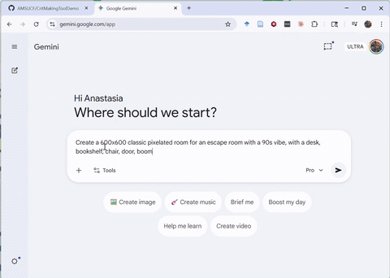

# Exercise Thirteen: Tools

This week's optional exercise is to build your own tool for simple making. We've been working with tools maintained by individuals and small teams throughout the sememester, from Bitsy to Twine and Tracery. Think small and use Claude Code to develop a simple web interface that allows the user to "create" something within a genre.

## The Tools Prompt

This week's prompt is intentionally flexible and open to your creative and professional goals, so think about what might be useful to you in the future. My video walks through one example, making a [tool](https://anastasiasalter.net/CritMakingToolDemo/) that allows the user to import an image and build a simple, one-room P5.js escape room. Here's a shortened walkthrough of the process behind this example:

Notice how this tool includes both a demo of it in action (built from a generated sample image, and customized directly by me using the tool itself) and an export fuction to allow the user to take their game and customize it further or share it on any platform. This is very far from the complexity of Bitsy, Twine, and Tracery, but it demonstrates how agentic AI works as a meta-tool, allowing us to build better interfaces for the specific work we want to do.

As you work on your tool, make sure to include:

- **Something the user can edit directly.** Remember that the value of the low-code and no-code tools we've used this semester lies in providing both freedom and constraints, so consider what you are going to control and where the user will be able to build something new with intention.

- **A sample outcome.** Without some example, it is difficult for a user to pick up a tool and know what it is useful for. You can start by generating the sample, but make sure to try customizing and building something directly with your own tool to see if it works.

- **Options for export.** In order to count as a "tool," the thing you produce must allow the user to build something and take it into other contexts. I recommend specifying that you are building a web interface that exports to HTML, but if you have something else in mind (a Python utility that builds a spreadsheet, etc.) feel free to do that instead - just host and share the code itself on GitHub so others can try it.

As always, please share screenshots from your process as well as a link to your tool prototype on GitHub (either the repository or the working website, depending on what type of tool you make)! As this is an optional exercise and I don't know how many people will complete it, comments are not required to receive full credit.
